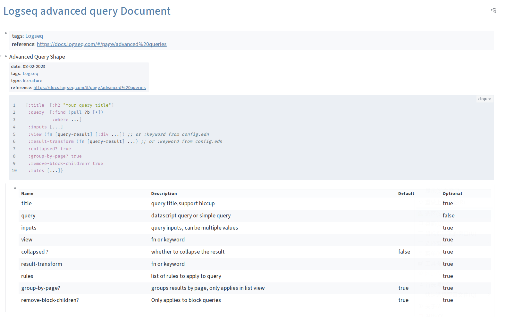

# 🧠 Logseq Flow Nord Theme
A minimal theme that focuses on a clean and sleek interface that's soft on the edges and comes with a large variety of color palettes.

Logseq Flow Theme's nord color palettes, most of code copied from https://github.com/nmartin84/logseq-flow.

## 🚀 Features

### Custom Bullets
Bullets in Flow will use the tabler-icons fonts to render bullets. What this means is that you can easily swap out bullets with a custom icon when the block contains page-references that match a particular keyword.

#### Customizing Bullets:
Bullets can now be customized to represent whatever tabler-icon you would like. Just add the following to your custom.css and replace "REPLACEME" with whatever page-reference you would like to target, and replace the hex code in `content: "\HEX"` with the hex code from the tabler-icons set. For a list of icons check https://tabler-icons.io/.
```css
  .ls-block[data-refs-self*='"REPLACEME'] > .flex.flex-row.pr-2 .bullet-container .bullet:before {
    content: "\edcd" !important;
    font-family: 'tabler-icons240';
    color: hsl(var(--cl-primary), 0.95);
    background-color: hsl(var(--cl-primary), 0.15);
    border-radius: 50%;
  }
  .ls-block[data-refs-self*='"REPLACEME']>.flex.flex-row.pr-2>.block-control-wrap a>.bullet-container.bullet-closed>.bullet:before {
    background-color: var(--ls-block-bullet-border-color);
  }
```

### Panels
Panels are grouped together by their breadcrumbs. What this means is that you'll no longer see an entire document use the same background color throughout the entire document. Instead they are now broken out into groups by the parent block:

### Built-in Plugins

- Kanban block view (@cannibalox)

Support inline tag: `#kanban` `#kanban-small` `#kanban-w200` `#kanban-w300` `#kanban-w400`

### ⚙️ Custom Settings

The custom.css file can take the following options to tweak the visuals.
```css
:root {
  --cl-page-width: 900px;
  --cl-page-max-width: 100%;
  --cl-checkbox-background: hsl(var(--cl-accent), 0);
  --cl-checkbox-border: 1.7px;
  --cl-checkbox-radius: 2px;
  --cl-checkbox-opacity: 1;
  --cl-marker-color: var(--cl-primary);
  --cl-marker-pre-size: 0px;
  --cl-marker-size: 16px;
  --cl-mark-decoration: none;
  --cl-mark-background-color: var(--cl-primary), 0.0;
  --cl-mark-color: hsl(var(--cl-primary));
  --cl-tag-border: 10px;
  --cl-tag-color: var(--cl-text-color), 0.85;
  --cl-tag-background-color: var(--cl-text-color), 0.1;
  --cl-children-left-border: transparent;
  --cl-children-border-color: hsl(var(--cl-text-color), 0.15);
  --cl-selected-background-color: var(--cl-primary), 0.1;
  --cl-selected-color: var(--cl-primary), 1;
  --cl-font-family: "Euclid Circular A";
  --cl-font-size: 16px;
  --cl-font-weight: 400;
  --cl-font-family-code: "Fira Code";
  --cl-header-font: "Roboto Slab";
  --cl-title-font: "Roboto Slab";
}
```

- `--cl-font-family`  :  set font famliy
- `--cl-font-size`    :  set font size
- `--cl-font-weight`  :  set font weight
- `--cl-font-family-code`  :  set code font famliy

Valid color options you can specify are `--cl-primary`, `--cl-secondary`, `--cl-accent`,
`--cl-dark-bg-color-h`, `--cl-dark-bg-color-s`, `--cl-dark-bg-color-l`,
`--cl-light-bg-color-h`, `--cl-light-bg-color-s`, `--cl-light-bg-color-l`,
`--cl-dark-text-color`, or `--cl-light-text-color`.
Change theme to Logseq Nord Theme **Default** , the colors will take effective.

```css
:root {
  --cl-primary:   33,90%,65% !important;
  --cl-secondary: 168,22%,55% !important;
  --cl-accent:    196,64%,58% !important;

  --cl-dark-bg-color-h: 220;
  --cl-dark-bg-color-s: 16%;
  --cl-dark-bg-color-l: 22%;

  --cl-light-bg-color-h: 218;
  --cl-light-bg-color-s: 27%;
  --cl-light-bg-color-l: 94%;

  --cl-dark-text-color: 219,28%,88%;
  --cl-light-text-color: 220,16%,22%
}
```

## 🚀 Demo
- Clean stylish theme that focuses on simplicity rather than flashy
- Curved edges over jagged edges
- Reference Panels Style around each match rather than each document
- Improved block ref styling




## Style


## ⌨️ Installation

Manually:
- Clone or Download the latest [release](https://github.com/henices/logseq-flow-nord/releases)
  - If downloaded unpack the ZIP contents to a safe location
- In logseq enable the developer mode
- Open the Plugin Manager window
- Click on "Load unpacked plugin"
- Navigatge to the folder you either cloned or unpacked

## Recommend Logseq Plugins

### Bullet Threading Plugin

Install [Bullet Threading](https://cdn.jsdelivr.net/gh/pengx17/logseq-dev-theme@master/bullet_threading.css) plugin via custom.css 

```
@import url("https://cdn.jsdelivr.net/gh/pengx17/logseq-dev-theme@master/bullet_threading.css"); /* bullet thrading*/
```

### [Tabs](https://github.com/pengx17/logseq-plugin-tabs) Plugin

## Thanks
- [Tabler Icons](https://github.com/tabler/tabler-icons)
